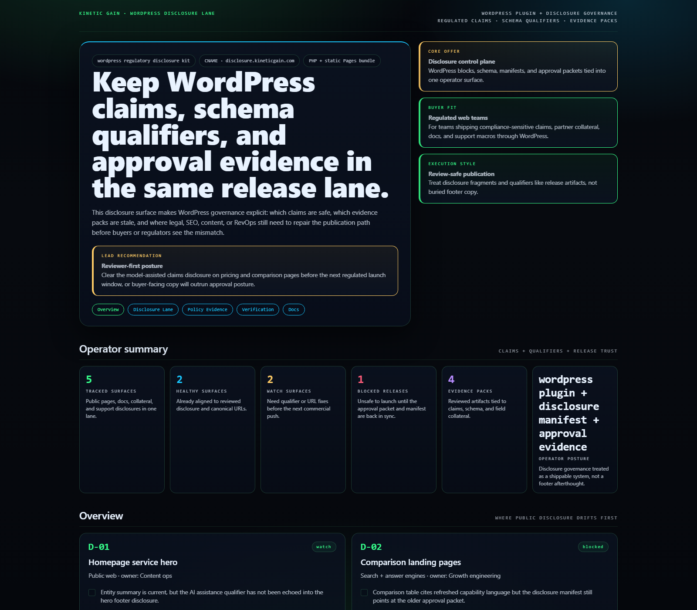
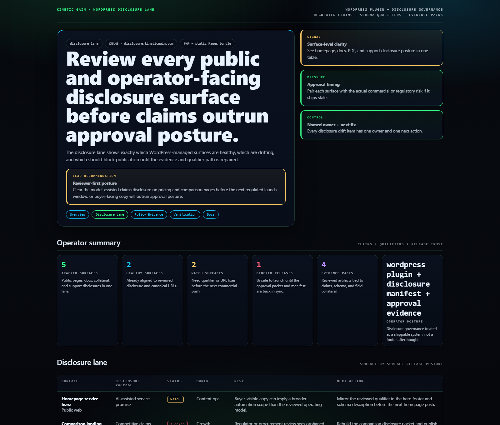
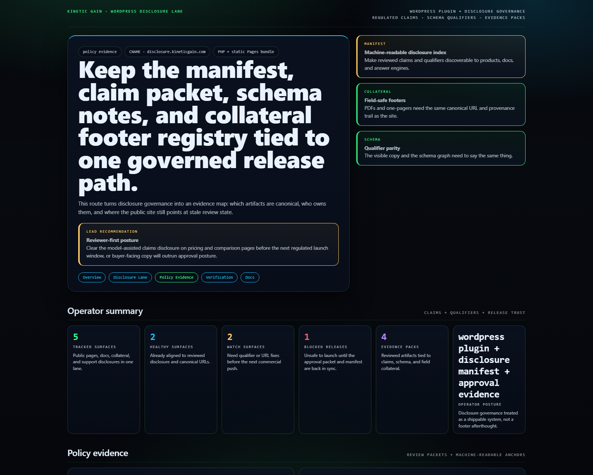
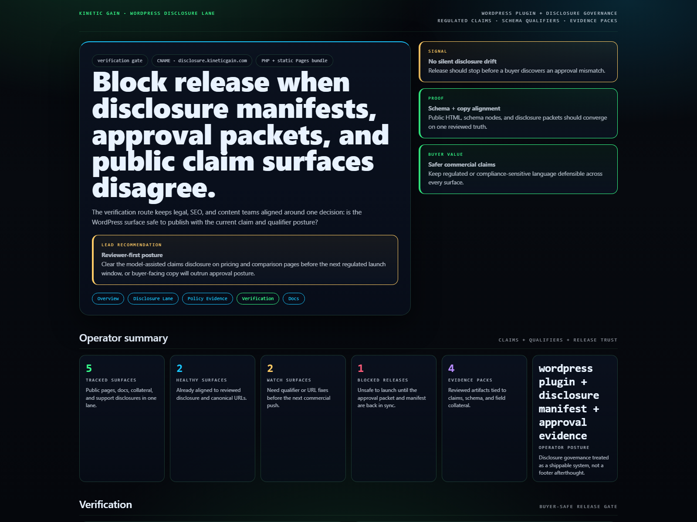

# WordPress Regulatory Disclosure Kit

WordPress disclosure control plane for regulated copy, schema-aligned service disclaimers, approval evidence, and review-safe publication posture.

## Why this exists

- WordPress is usually where disclosure drift becomes public first: homepage claims, FAQ schema, PDFs, support macros, and product docs can all diverge.
- Legal, SEO, RevOps, and content teams need a single view of which disclosure surfaces are healthy, which are stale, and which are blocking release.
- Buyer-safe claims require the public page, the machine-readable schema, and the approval packet to stay in the same release lane.

## Why this matters (KG Embedded tie-back)

This repo demonstrates the disclosure-governance primitive for Kinetic Gain Embedded: reviewed claim fragments, machine-readable manifests, approval evidence, and release-safe qualifiers exposed through one operator surface. In a real embedded setting, the same primitive lets SaaS teams keep product copy, support answers, docs, and commercial collateral aligned without turning every release into manual legal archaeology.

## Routes

- `/`
- `/disclosure-lane`
- `/policy-evidence`
- `/verification`
- `/docs`

## API

- `/api/dashboard/summary`
- `/api/disclosure-lane`
- `/api/policy-evidence`
- `/api/verification`
- `/api/sample`

## Screenshots






## Local development

```powershell
cd wordpress-regulatory-disclosure-kit
php -S 127.0.0.1:5436 .\router.php
```

Open:
- [http://127.0.0.1:5436/](http://127.0.0.1:5436/)
- [http://127.0.0.1:5436/disclosure-lane](http://127.0.0.1:5436/disclosure-lane)
- [http://127.0.0.1:5436/policy-evidence](http://127.0.0.1:5436/policy-evidence)
- [http://127.0.0.1:5436/verification](http://127.0.0.1:5436/verification)

## Validation

- `php -l public\index.php`
- `php -l src\Services\RegulatoryDisclosureKitService.php`
- `php -l src\Views\render.php`
- `php -l plugin\wordpress-regulatory-disclosure-kit.php`
- `php scripts\run_demo.php`
- `php scripts\prerender.php`
- `powershell -ExecutionPolicy Bypass -File .\scripts\smoke_check.ps1`
- `powershell -ExecutionPolicy Bypass -File .\scripts\render_readme_assets.ps1`

## Production status

| Aspect | Status |
|--------|--------|
| License | [AGPL-3.0-or-later](./LICENSE) |
| Security | [SECURITY.md](./SECURITY.md) |
| Deploy | Static prerender -> **https://disclosure.kineticgain.com/** |
| WordPress primitive | Disclosure manifest shortcode + REST route |

## Docs

- [Architecture](./docs/architecture.md)
- [Origin](./docs/ORIGIN.md)
- [Kinetic Gain Embedded tie-back](./docs/KINETIC_GAIN_EMBEDDED.md)
- [Changelog](./CHANGELOG.md)

## Part of the Kinetic Gain Suite

Operator surface in the [Kinetic Gain Suite](https://suite.kineticgain.com/) — a portfolio of buyer-readable control planes spanning security posture, compliance evidence, data-platform governance, FinOps, and operator workflows. See the suite index for related surfaces. Apex: [kineticgain.com](https://kineticgain.com/).
